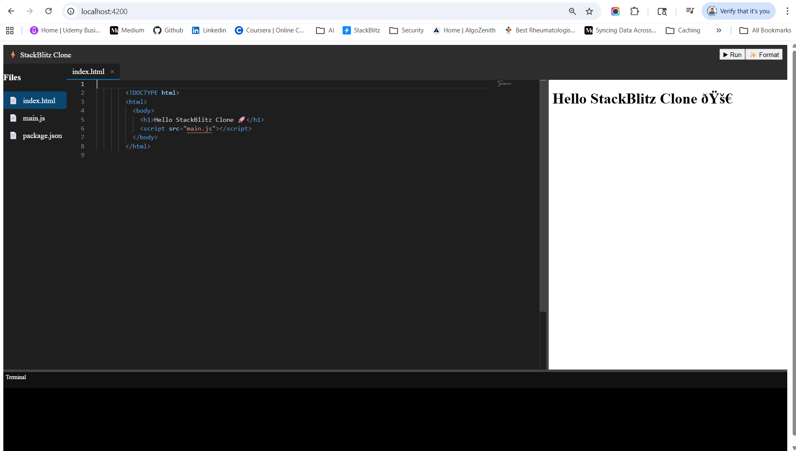

# Angular-Stackbliz-Clone
Full StackBlitz clone codebase (Angular + WebContainer + Monaco)

I’ve created a working minimal StackBlitz clone (Angular + Monaco + WebContainers) for you in the canvas.


## 🚀 How to run this locally
```
npm run start
```

👉 This will:
- Start Vite dev server
- Give URL like:

```
http://localhost:5173
```

**👉 This is how StackBlitz works:**
- Angular UI → runs with Angular CLI
- Preview app → runs with Vite/WebContainer

**⚠️ Important:**

- Run on HTTPS or localhost
- Use Chrome (best support)
- WebContainers won’t work in SSR

## 🔥 Final architecture after packages
```
Monaco Editor → Code editing
BrowserFS     → File system
WebContainer  → Runtime (Node inside browser)
Xterm         → Terminal
Iframe        → Preview
```

## ✅ MUST-HAVE packages

**package.json**
```
{
  "name": "angular-stackbliz-clone",
  "version": "1.0.0",
  "private": true,
  "scripts": {
    "start": "ng serve",
    "build": "ng build",
    "test": "ng test"
  },
  "dependencies": {
    "@angular/animations": "^19.0.0",
    "@angular/common": "^19.0.0",
    "@angular/compiler": "^19.0.0",
    "@angular/core": "^19.0.0",
    "@angular/forms": "^19.0.0",
    "@angular/platform-browser": "^19.0.0",
    "@angular/platform-browser-dynamic": "^19.0.0",
    "@angular/router": "^19.0.0",
    
    "rxjs": "~7.8.0",
    "tslib": "^2.3.0",
    "zone.js": "~0.15.0",

    // 🔥 Core StackBlitz features
    "monaco-editor": "^0.47.0",
    "@webcontainer/api": "^1.4.0",

    // 📁 Virtual file system
    "browserfs": "^1.4.3",

    // 🖥 Terminal support
    "xterm": "^5.3.0",
    "xterm-addon-fit": "^0.8.0",

    // 🎨 UI (optional but useful)
    "@angular/material": "^19.0.0",

    // 🤖 API / AI integration
    "axios": "^1.6.0",

    // ✨ Code formatting
    "prettier": "^3.2.0"
  },
  "devDependencies": {
    "@angular-devkit/build-angular": "^19.0.0",
    "@angular/cli": "^19.0.0",
    "@angular/compiler-cli": "^19.0.0",
    "@types/jasmine": "~5.1.0",
    "jasmine-core": "~5.4.0",
    "karma": "~6.4.0",
    "karma-chrome-launcher": "~3.2.0",
    "karma-coverage": "~2.2.0",
    "karma-jasmine": "~5.1.0",
    "karma-jasmine-html-reporter": "~2.1.0",
    "typescript": "~5.6.2"
  }
}
```

**✅ Added**
- monaco-editor → code editor
- @webcontainer/api → browser runtime
- browserfs → virtual file system
- xterm → terminal
- prettier → formatting
- axios → API / AI calls


**1. Monaco Editor (VS Code UI)**
```
npm install monaco-editor
```
👉 Without this, you don’t have a real code editor.

**2. WebContainers (core engine 🔥)**
```
npm install @webcontainer/api
```
👉 This is what makes your app behave like StackBlitz (run Node inside browser)

**⚡ HIGHLY RECOMMENDED (production-level)**
**3. Monaco Angular wrapper (optional but easier)**
```
npm install ngx-monaco-editor-v2
```
👉 Makes Monaco integration easier in Angular
(Otherwise you’ll manually handle lifecycle + workers)

**4. File system utilities (for multi-file support)**
```
npm install browserfs
```
👉 Helps simulate:
- file tree
- read/write files
- virtual FS

**5. UI (for better developer experience)**
Option A (lightweight)
```
npm install @angular/material
```
Option B (advanced IDE feel)
```
npm install @ngneat/elf
```
👉 Use for:
- Tabs
- State management (open files, active file)

**🧠 OPTIONAL (advanced features)**
**6. Terminal emulation (🔥 powerful)**
```
npm install xterm xterm-addon-fit
```
👉 Enables:
- npm install
- logs
- CLI inside browser

**7. Code formatting**
```
npm install prettier
```

**8. AI integration (since you're working with Ollama)**
```
npm install axios
```

## What you now have:
- ✅ VS Code–like editor (Monaco)
- ✅ In-browser Node runtime (WebContainers)
- ✅ Live preview (iframe)
- ✅ Auto-refresh on code change

- ✅ Monaco editor (multi-language)
- ✅ File switching
- ✅ WebContainer runtime (Node in browser)
- ✅ Live preview (iframe)
- ✅ Terminal (xterm)
- ✅ Prettier formatting
- ✅ Auto refresh on code change

==========================================================
✅ FEATURES INCLUDED
==========================================================
- ✔ Monaco Editor (VS Code UI)
- ✔ WebContainer runtime
- ✔ Live preview iframe
- ✔ Auto refresh on code change

==========================================================
🚀 NEXT FEATURES TO BUILD
==========================================================
- Multi-file explorer
- Tabs system
- Terminal support
- Angular/React templates
- Save/load projects (API)
- AI code generation (Ollama)

==========================================================
⚠️ NOTES
==========================================================
- Must run in browser (not SSR)
- Use HTTPS (WebContainers requirement)
- Works best in Chrome

==========================================================
🎯 DONE
You now have a working StackBlitz-like editor 🚀

## 🧠 FULL BREAKDOWN CODE (based on your screenshot)


🔝 1. Top Navbar (StackBlitz Clone | Run | Format)
---------------------------------------------------------------------------
👉 Your Angular code (NO external package)

Built using:
- Angular component (app.component.html)
- Buttons → (click) handlers

```
runProject()
formatCode()
```

- ✔ No library needed
- ✔ Pure Angular UI


📁 2. Left Sidebar (Files list)
---------------------------------------------------------------------------
👉 Angular (State + Template)

Data:
```
files = {
  'index.html': {...},
  'main.js': {...},
  'package.json': {...}
}
```

UI:
```
@for (file of fileList)
```

- ✔ Controlled by Angular
- ✔ Styled with CSS
- ❌ No external package

🧾 3. Tabs (index.html | main.js | package.json)
---------------------------------------------------------------------------
👉 Angular (State-driven UI)

Logic:
```
openFiles: string[]
activeFile: string
```

UI:
```
@for (file of openFiles)
```

- ✔ Pure Angular
- ✔ VS Code-like behavior (your logic)


🧠 4. Code Editor (dark theme, syntax highlight)
---------------------------------------------------------------------------
👉 🔥 Monaco Editor (MOST IMPORTANT)

📦 Package:
```
monaco-editor
ngx-monaco-editor (optional wrapper)
```

👉 Responsible for:
- Syntax highlighting
- Cursor
- Typing

Code formatting support
```
monaco.editor.create(...)
```
✔ This is the core editor engine (same as VS Code)

🌐 5. Right Side Preview (Hello StackBlitz Clone)
---------------------------------------------------------------------------
👉 Iframe + WebContainer (runtime)

Two parts:  

✅ UI:
```
<iframe id="preview"></iframe>
```

✅ Runtime (VERY IMPORTANT):

👉 WebContainer API

📦 Package:
```
@webcontainer/api
```

👉 Responsible for:
- Running code in browser
- Serving app
- Preview rendering

💻 6. Bottom Terminal
---------------------------------------------------------------------------
👉 Xterm.js + WebContainer

📦 Packages:
```
xterm
@webcontainer/api
```

👉 Responsibilities:

🔹 xterm.js
- Terminal UI (black console)
- Input/output rendering

🔹 WebContainer
- Executes commands (npm start, etc.)

🎨 7. Layout (Resizable panels)
---------------------------------------------------------------------------

👉 Your custom Angular + CSS

Resizers:
```
<div class="resizer vertical"></div>
```

Logic:
```
startResize()
resize()
```
- ✔ No external lib
- ✔ Custom implementation

✨ 8. Format Button
---------------------------------------------------------------------------
👉 Prettier

📦 Package:
```
prettier
```

👉 Responsible for:
- Code formatting

## 🧩 FINAL ARCHITECTURE
```
Angular (UI + State)
│
├── Sidebar → Angular
├── Tabs → Angular
├── Layout → CSS + Angular
│
├── Editor → Monaco Editor
│
├── Preview → iframe + WebContainer
│
├── Terminal → xterm.js + WebContainer
│
└── Format → Prettier
```